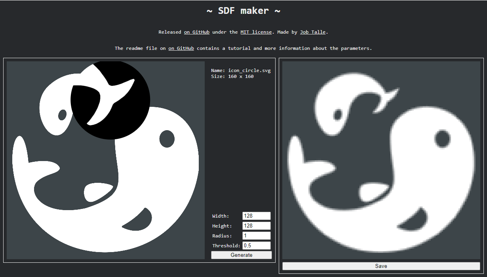

# SDF Maker
A tool for converting high resolution images or textures with transparency to low resolution images with signed distance fields.
[Runs in a browser!](https://jobtalle.com/SDFMaker)

## How to use it?

1. Drag an image file to the drop target on the left. This can be a .PNG image with transparency or a .SVG vector image.
2. Choose the output resolution. For good results, the output resolution should be several times smaller than the input resolution. If the input image is a .SVG image, the tool converts it to a 4k input image to ensure the input resolution is high enough.
3. Click the "generate" button to produce the output image. The output image is a .PNG image that can be downloaded.

The quality of the output SDF can be previewed by hovering the cursor over the left panel that contains the input image. A circular area around the mouse shows how the SDF sprite will be rendered. If the left mouse button is pressed, the preview is zoomed by 200%.

## Settings

|Setting|Description|
|---|---|
|Radius|The radius of the signed distance field. This can be 1 in most cases, but it can be increased if the SDF will be used for things like outline rendering.|
|Threshold|The input image opacity threshold that is considered opaque. Any input pixel with alpha over this threshold is considered opaque.|